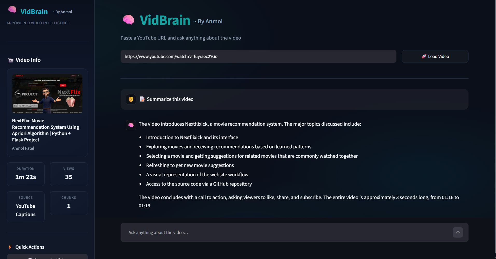

<h1 align="center">🧠 VidBrain</h1>
<h3 align="center">YouTube Video Q&A Chatbot — Powered by Groq</h3>

<p align="center">
  
</p>

<p align="center">
  
  
  
  
  
</p>

---

## 📌 Project Overview

Ever watched a 2-hour YouTube video and wished you could just *ask it a question?*

**VidBrain** is a production-ready YouTube Video Q&A chatbot that lets you paste any YouTube URL and chat with the video like it's a document. It automatically fetches YouTube captions when available, and falls back to **Groq Whisper Large V3 Turbo** for transcription when captions are missing. It then builds a local FAISS vector store using **FastEmbed** and answers your questions using **Groq's Llama 3.3 70B** model — entirely through Groq's blazing fast inference APIs.

---

## 📁 Repository Structure

```
VidBrain/
├── utils/
│   ├── audio_downloader.py     # yt-dlp audio extraction & chunking
│   ├── cache_manager.py        # Four-layer local cache (metadata, transcript, chunks, vectorstore)
│   ├── helpers.py              # Formatting utilities for UI
│   ├── rag_pipeline.py         # LangChain RAG chain, retriever, LLM setup
│   ├── transcriber.py          # Groq Whisper transcription & cleaning
│   └── transcript_loader.py    # YouTube captions fetch & cleaning
│
├── cache/                      # Auto-generated — persists processed video data
├── temp/                       # Auto-generated — temporary audio files
├── images/
│   └── VidBrainDemo.gif
│
├── app.py
├── requirements.txt
├── .env.example
├── .gitignore
└── README.md
```

---

## 🛠️ Tech Stack

| Layer | Tool |
|---|---|
| UI | `Streamlit` |
| LLM | Groq API — `llama-3.3-70b-versatile` |
| Transcription | Groq API — `whisper-large-v3-turbo` |
| Embeddings | `FastEmbed` (lightweight ONNX models) |
| Vector Store | `FAISS` (local) |
| RAG Framework | `LangChain` |
| Audio Extraction | `yt-dlp` + `pydub` |
| Caching | Custom `CacheManager` (JSON + Pickle + FAISS local) |

---

## ✨ Features

- **Blazing Fast** — Powered exclusively by Groq's inference API. No heavy local models to load.
- **Smart Transcription Fallback** — Uses YouTube Captions first; seamlessly falls back to Groq Whisper when captions are unavailable.
- **Auto Audio Chunking** — Compresses audio to 64kbps and splits at 30-minute intervals to stay within Groq's 25MB file size limit.
- **Zero Redundant Processing** — Aggressively caches metadata, transcripts, chunks, and vector stores per video ID. Reloading a video is instant.
- **Conversational Context** — Full chat history is preserved across turns. Follow-up questions are automatically rephrased into standalone search queries before retrieval.
- **Precise Citations** — Every answer surfaces the exact transcript segments used for grounding.
- **Quick Insights** — One-click buttons for Summarize, Key Takeaways, and Important Topics.

---

## ⚙️ Pipeline Walkthrough

1. User pastes a YouTube URL → video ID extracted
2. **Metadata** fetched via `yt-dlp` (title, channel, duration, views) → cached
3. **Transcript** fetched via `youtube-transcript-api` → if unavailable, audio downloaded via `yt-dlp`, chunked if needed, transcribed via Groq Whisper → cached
4. Transcript cleaned — timestamps embedded every ~60 seconds
5. **Text splitting** via `RecursiveCharacterTextSplitter` (chunk size: 1200, overlap: 250) → cached
6. **Embeddings** generated via `FastEmbedEmbeddings` → FAISS vector store built and saved locally
7. **Retriever** configured with MMR search (`k=8`, `fetch_k=20`) — first chunk always injected for intro context
8. **LLM** initialized — `ChatGroq` with `llama-3.3-70b-versatile`
9. **RAG chain** built with `create_retrieval_chain` + `MessagesPlaceholder` for chat history
10. On each question — follow-up queries rephrased → retrieved → answered → sources displayed

---

## 🔍 RAG Design Decisions

**Why MMR retrieval?**
Maximum Marginal Relevance balances relevance with diversity — prevents the retriever from returning 8 near-identical chunks from the same part of the video.

**Why always inject the first chunk?**
The video introduction almost always contains context (topic, speaker, scope) that improves answer quality — even when it's not the closest match to the query.

**Why rephrase follow-up questions?**
"What did he say about that?" is useless as a vector search query. The rephrasing step rewrites it into something like "What did the speaker say about gradient descent?" before hitting the retriever.

---

## 📦 Setup Instructions

### 1. Prerequisites

Ensure `ffmpeg` is installed on your system (required for `pydub` audio processing).

**Mac:**
```bash
brew install ffmpeg
```
**Windows:**
Download from [gyan.dev](https://www.gyan.dev/ffmpeg/builds/) and add to PATH.

### 2. Clone and Install

```bash
git clone https://github.com/AnmolPatel20/VidBrain.git
cd VidBrain

# Create virtual environment
python -m venv venv
source venv/bin/activate        # macOS / Linux
# venv\Scripts\activate         # Windows

# Install dependencies
pip install -r requirements.txt
```

### 3. API Key

```bash
cp .env.example .env
```

Edit `.env` and add your Groq API key:
```
GROQ_API_KEY=gsk_your_actual_key_here
```

Get a free key at [console.groq.com/keys](https://console.groq.com/keys)

### 4. Run

```bash
streamlit run app.py
```

---

## 💬 Usage

1. Paste any YouTube URL into the input field
2. Click **🚀 Load Video** — VidBrain processes the video and builds the knowledge base
3. Ask anything in the chat box
4. Use the sidebar quick-action buttons for instant summaries and takeaways
5. Expand **📚 View Transcript Sources** under any answer to see the grounding segments

> Videos already processed are loaded instantly from cache — no re-downloading or re-embedding.

---

## 📌 Notes

- The `cache/` and `temp/` directories are auto-created on first run — add them to `.gitignore`
- Groq Whisper transcription requires a valid API key and is only triggered when YouTube captions are unavailable
- For very long videos (2h+), audio is automatically split into 30-minute chunks before transcription
- The LLM is instructed to answer *only* from the transcript — it will not hallucinate outside knowledge

---

## 🙋 About

I'm on my machine learning journey — building, experimenting and documenting as I go. Every project here represents something I've genuinely tried to understand, not just run. 🚀

- GitHub: [@AnmolPatel20](https://github.com/AnmolPatel20)
- Portfolio: [anmolpatel20.github.io/Anmol_Portfolio](https://anmolpatel20.github.io/Anmol_Portfolio/)

## 🙏 Acknowledgements
*"Not all those who wander are lost." — J.R.R. Tolkien*

---

<p align="center">⭐ Star this repo if you found it helpful!</p>
